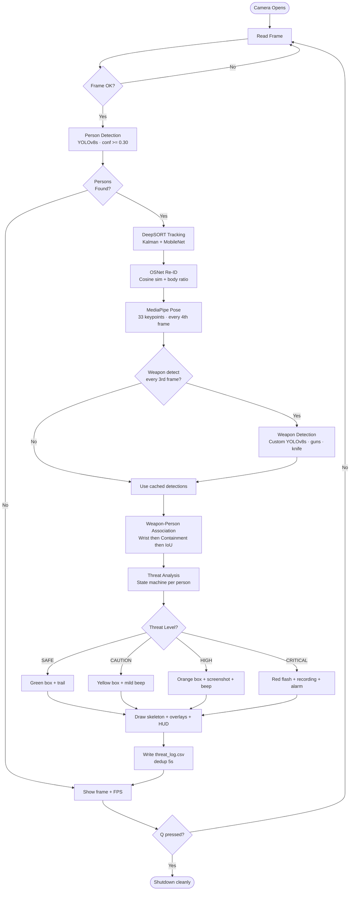
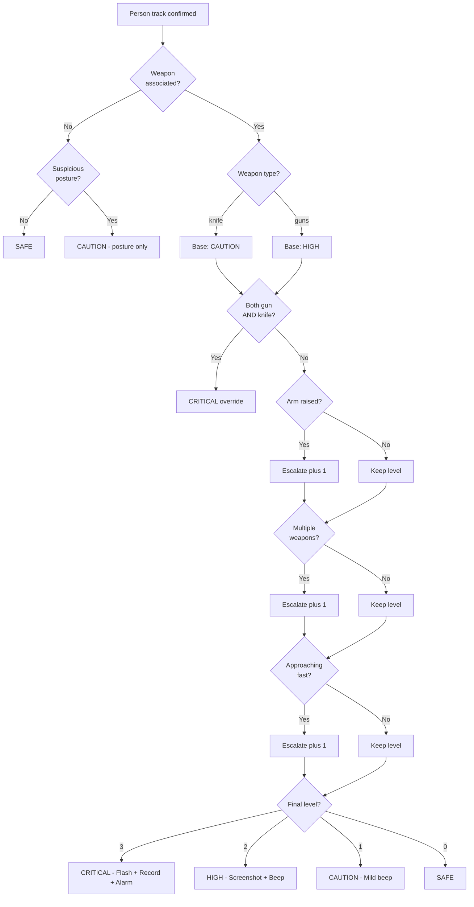
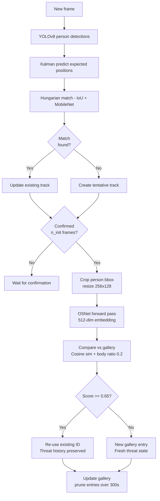
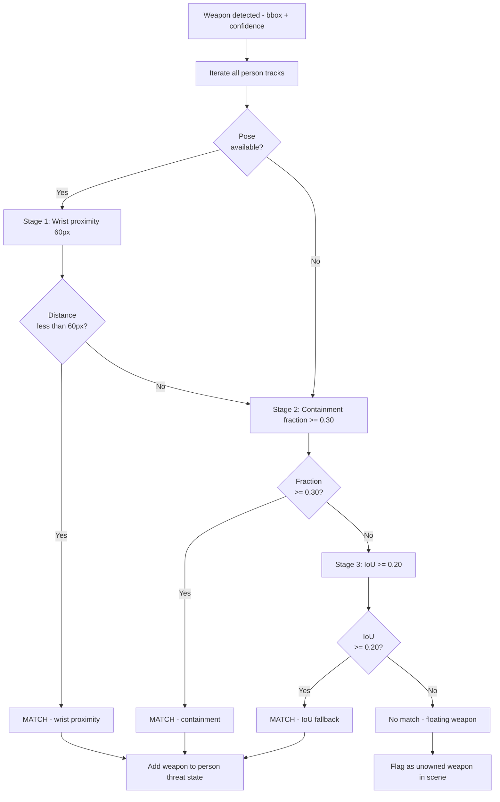
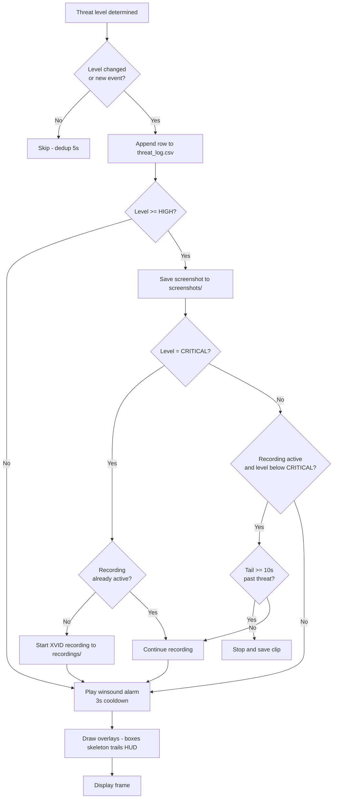

# AI Smart Threat Detection System
### Project Overview — Mentor Presentation

> **Type:** Real-time AI-powered CCTV Surveillance & Threat Analysis
> **Language:** Python 3.9+ · PyTorch · CUDA
> **Status:** Phase 1 Complete · Phase 2–3 Planned
> **Date:** April 2026

---

**5 AI models &nbsp;·&nbsp; 10 algorithms &nbsp;·&nbsp; 4 datasets &nbsp;·&nbsp; 16 active capabilities &nbsp;·&nbsp; 11 future features planned**

---

## Table of Contents

| | Section |
|--|---------|
| **PART 1** | **Project Overview** |
| 1.1 | [Problem Statement](#11-problem-statement) |
| 1.2 | [What This System Does](#12-what-this-system-does) |
| 1.3 | [Development History](#13-development-history) |
| **PART 2** | **Phase 1 — What We Built** |
| 2.1 | [System Architecture](#21-system-architecture) |
| 2.2 | [Full Pipeline Flowchart](#22-full-pipeline-flowchart) |
| 2.3 | [Module Reference](#23-module-reference) |
| 2.4 | [Algorithms Used](#24-algorithms-used) |
| 2.5 | [Models Used](#25-models-used) |
| 2.6 | [Datasets Used](#26-datasets-used) |
| 2.7 | [Threat Level System](#27-threat-level-system) |
| 2.8 | [Detailed Flowcharts](#28-detailed-flowcharts) |
| 2.9 | [Current Capabilities](#29-current-capabilities) |
| 2.10 | [Configuration Reference](#210-configuration-reference) |
| 2.11 | [File Structure](#211-file-structure) |
| **PART 3** | **Next Steps — Roadmap** |
| 3.0 | [Roadmap Overview](#30-roadmap-overview) |
| 3.1 | [Phase 2A — Behaviour Detection](#31-phase-2a--behaviour-detection) |
| 3.2 | [Phase 2B — Identity and Biometrics](#32-phase-2b--identity-and-biometrics) |
| 3.3 | [Phase 3 — Infrastructure](#33-phase-3--infrastructure) |
| 3.4 | [Future Algorithm Additions](#34-future-algorithm-additions) |
| **Appendix** | |
| A | [Tech Stack](#appendix-a--tech-stack) |
| B | [How Each Algorithm Benefits the System](#appendix-b--how-each-algorithm-benefits-the-system) |

---

---

# PART 1 — Project Overview

---

## 1.1 Problem Statement

Standard CCTV systems are **passive recorders**. They capture footage but cannot reason about what is happening in it. A security guard must watch every screen continuously to catch a threat, and by the time a human spots a weapon or a fight, valuable response time is already lost.

This project answers one question:

> **Can AI watch a camera feed, understand what it sees, and alert operators the moment a real threat emerges — without human eyes on the screen?**

---

## 1.2 What This System Does

The AI Smart Threat Detection System converts any standard webcam or CCTV feed into an active, intelligent security layer. Every frame is analysed in real time to:

- **Detect** every person and every weapon visible in the frame
- **Track** each individual with a persistent unique ID across the entire session
- **Re-identify** a person who leaves and re-enters the scene, preserving their threat history
- **Read body language** — raised arms, aggressive posture, how fast someone is approaching
- **Classify** each person's threat level: `SAFE → CAUTION → HIGH → CRITICAL`
- **Alert** security operators instantly via on-screen overlays, audio alarms, and a timestamped log
- **Record** screenshots and video clips as legal evidence the moment a threat is detected

The result is a system that moves from **passive recording to active, intelligent threat prevention**.

---

## 1.3 Development History

The system was built in five incremental stages. Each stage added one layer of capability on top of the last:

| Stage | Script(s) | What was added |
|-------|-----------|----------------|
| 1 | `old/wepon_pre.py` | YOLOv8 weapon inference on webcam — bounding boxes only |
| 2 | `old/wepon_pre2.py` | DeepSORT tracker added on top of weapon detections |
| 3 | `old/person_detct_2/3/4.py` | Person detection, FPS timing, MobileNet embedder |
| 4 | `old/combine_1.py`, `combine_2.py` | Both models running simultaneously, joint visualisation |
| **5** | **`main.py` + all modules** | **Full pipeline: detection → tracking → Re-ID → pose → association → threat analysis → alerts → logging → recording** |

---

---

# PART 2 — Phase 1: What We Built

---

## 2.1 System Architecture

```
┌─────────────────────────────────────────────────────────────────────┐
│                       CCTV / Webcam Input                           │
│                    640 × 480 · Real-time stream                     │
└──────────────────────────┬──────────────────────────────────────────┘
                           │  Raw frame
                           ▼
┌─────────────────────────────────────────────────────────────────────┐
│                    PERSON DETECTION                                  │
│           YOLOv8s · COCO class 0 · conf ≥ 0.30 · CUDA              │
│        → Bounding boxes + confidence for every person               │
└──────────────────────────┬──────────────────────────────────────────┘
                           │  Person detections
                           ▼
┌─────────────────────────────────────────────────────────────────────┐
│                  MULTI-PERSON TRACKING                               │
│        DeepSORT · MobileNetV2 embedder · max_age 20 · n_init 2      │
│       → Stable track IDs · Kalman-predicted positions               │
└────────────┬────────────────────────────────────┬───────────────────┘
             │  Confirmed tracks                   │  Person crops
             ▼                                     ▼
┌─────────────────────────┐         ┌──────────────────────────────┐
│    POSE ESTIMATION      │         │     OSNet Re-ID GALLERY      │
│  MediaPipe BlazePose    │         │  osnet_x1_0 · 512-dim embed  │
│  33 keypoints / person  │         │  Cosine sim ≥ 0.65 · 12 samp │
│  Every 4th frame        │         │  Body-ratio fusion · 300 s   │
└────────────┬────────────┘         └──────────────────────────────┘
             │  Pose keypoints
             ▼
┌─────────────────────────────────────────────────────────────────────┐
│                    WEAPON DETECTION                                  │
│       Custom YOLOv8s · classes: guns / knife · conf ≥ 0.55          │
│       Temporal consistency filter · Every 3rd frame                 │
│       → Weapon bounding boxes + class label                         │
└──────────────────────────┬──────────────────────────────────────────┘
                           │  Weapon detections
                           ▼
┌─────────────────────────────────────────────────────────────────────┐
│                WEAPON–PERSON ASSOCIATION                             │
│   Stage 1: Wrist proximity  (60 px)                                 │
│   Stage 2: Containment fraction  (≥ 0.30)                           │
│   Stage 3: IoU fallback  (≥ 0.20)                                   │
│       → Maps each weapon to the person holding it                   │
└──────────────────────────┬──────────────────────────────────────────┘
                           │  Weapon ↔ Person associations
                           ▼
┌─────────────────────────────────────────────────────────────────────┐
│                    THREAT ANALYSIS                                   │
│   Weapon type · Arm raised · Approach speed · Multiple weapons      │
│   Hysteresis state machine · 45-frame downgrade protection          │
│       → SAFE / CAUTION / HIGH / CRITICAL per person                 │
└──────────────────────────┬──────────────────────────────────────────┘
                           │  Threat levels
                           ▼
┌─────────────────────────────────────────────────────────────────────┐
│                      ALERT MANAGER                                   │
│   Colored boxes · Skeleton overlay · Motion trails · Status HUD     │
│   CSV threat log · Screenshot on HIGH+ · XVID recording on CRITICAL │
│   winsound alarm · 3-second cooldown between beeps                  │
└─────────────────────────────────────────────────────────────────────┘
```

---

## 2.2 Full Pipeline Flowchart



---

## 2.3 Module Reference

| File | Responsibility | Key Libraries |
|------|---------------|---------------|
| `main.py` | Main loop · module orchestration | `opencv-python`, `torch` |
| `config.py` | All thresholds, paths, parameters | — |
| `detection.py` | YOLOv8 person and weapon inference | `ultralytics` |
| `tracker.py` | DeepSORT + OSNet Re-ID gallery | `deep_sort_realtime`, `torchreid` |
| `pose_estimator.py` | MediaPipe keypoint extraction | `mediapipe` |
| `association.py` | Weapon ↔ person geometric linking | `numpy` |
| `threat_analyzer.py` | Per-person threat state machine | pure Python |
| `alert_manager.py` | Overlays · CSV log · screenshots · recordings · audio | `opencv-python`, `winsound` |

---

## 2.4 Algorithms Used

### 2.4.1 YOLOv8 — You Only Look Once

**Role:** Object detection — persons and weapons

YOLOv8 processes the entire image in a single neural network forward pass, simultaneously predicting bounding boxes and class labels for all objects with no region-proposal step.

| Property | Detail |
|----------|--------|
| Architecture | Anchor-free single-stage CNN |
| Backbone | CSPDarknet with C2f bottleneck modules |
| Neck | PAN-FPN feature pyramid |
| Head | Decoupled classification + regression heads |
| Post-processing | NMS · Soft-NMS enabled |
| Speed | ~30–60 FPS on a modern GPU |

**Why YOLOv8:**
- Single forward pass — no slow region-proposal step
- Excellent at detecting small objects like knives at distance
- Transfer learning from COCO reduces custom training data requirements
- Simple Ultralytics API; actively maintained

**Two separate YOLO models run in parallel:**

| Instance | Weights | Trained on | Detects |
|----------|---------|-----------|---------|
| Person detector | `yolov8s.pt` | COCO (80 classes) | Person — class 0 only |
| Weapon detector | `best.pt` (fine-tuned) | Roboflow Weapon-2 v2 | `guns`, `knife` |

---

### 2.4.2 DeepSORT — Deep Simple Online and Realtime Tracking

**Role:** Persistent multi-person tracking — gives each person a stable ID across frames

| Parameter | Value | Meaning |
|-----------|-------|---------|
| `max_age` | 20 frames | Track survives 20 consecutive unseen frames before deletion |
| `n_init` | 2 frames | Must be detected twice before a track is confirmed |
| `nn_budget` | 100 | Max appearance vectors stored per track |
| Embedder | MobileNetV2 | Lightweight 128-dim appearance extractor |

**How it works each frame:**
1. **Kalman Filter** predicts where each existing track will be
2. **Hungarian Algorithm** finds the globally optimal match between track predictions and new detections
3. Matched tracks are updated; unmatched tracks age toward `max_age`; new unmatched detections become tentative tracks
4. **MobileNetV2** extracts a 128-dim appearance vector for each confirmed detection

**Why DeepSORT:**
- Kalman prediction maintains continuity when someone is briefly occluded
- Appearance features prevent ID-switch when two people cross paths
- Designed specifically for real-time surveillance workloads

---

### 2.4.3 OSNet — Omni-Scale Feature Network (Re-Identification)

**Role:** Recognising the same person after they re-enter the camera's view

OSNet produces a 512-dimensional feature embedding for a person crop that is robust to changes in lighting, viewpoint, and appearance.

| Property | Value |
|----------|-------|
| Model name | `osnet_x1_0` |
| Feature vector | 512 dimensions |
| Input crop size | 256 × 128 pixels |
| Similarity metric | Cosine similarity |
| Match threshold | ≥ 0.65 |
| Gallery samples per person | 12 diverse embeddings |
| Gallery age | 300 seconds (5 min) |
| Score fusion | Cosine (80%) + body aspect ratio (20%) |

**Gallery pipeline:**
1. Confirmed track → crop bounding box → resize to 256 × 128
2. OSNet forward pass → 512-dim feature vector
3. Compare against gallery: cosine similarity fused with body-ratio score
4. Score ≥ 0.65 → same person → preserve existing ID and threat history
5. Score < 0.65 → new person → new gallery entry
6. Gallery refreshed every 15 frames; entries pruned after 300 s of inactivity

**Why OSNet:**
- Purpose-built for Re-ID, not a general classifier
- Multi-scale features capture both fine texture and coarse shape
- Body-ratio fusion reduces false matches across people of different builds

---

### 2.4.4 Kalman Filter

**Role:** Motion prediction inside DeepSORT

Maintains an 8-dimensional state `[x, y, w, h, vx, vy, vw, vh]` per track. Predicts the expected bounding box one frame ahead so tracks persist through brief detection failures.

- Process noise models unpredictable acceleration
- Measurement noise models YOLO bounding-box jitter

---

### 2.4.5 Hungarian Algorithm (Linear Sum Assignment)

**Role:** Optimal track-to-detection matching inside DeepSORT

Given N existing tracks and M new detections, finds the globally optimal one-to-one assignment maximising combined IoU + appearance similarity. Runs in O(n³) — negligible overhead for typical scene sizes.

---

### 2.4.6 MediaPipe BlazePose

**Role:** Body keypoint extraction for posture-based threat signals

| Property | Value |
|----------|-------|
| Model file | `pose_landmarker_lite.task` |
| Keypoints per person | 33 landmarks |
| Output per landmark | `(x, y, z, visibility)` |
| Run frequency | Every 4th frame |
| Min visibility threshold | ≥ 0.50 |

**Threat-relevant joints:**

| Index | Joint | Used for |
|-------|-------|---------|
| 15, 16 | Left / right wrist | Weapon proximity check |
| 13, 14 | Left / right elbow | Arm angle calculation |
| 11, 12 | Left / right shoulder | Arm-raised detection |
| 23, 24 | Left / right hip | Body height reference |

**Arm-raised detection logic:**
```
arm_raised = True  when:
    wrist_y  <  shoulder_y        ← wrist is higher than shoulder in image
    AND  elbow_angle  <  45°      ← ARM_RAISE_ANGLE_THRESHOLD
```

---

### 2.4.7 Weapon–Person Association (3-Stage Cascade)

**Role:** Determining which person is holding which detected weapon

Each stage runs only if the previous stage produces no match — the most anatomically precise method is always tried first:

| Stage | Method | Threshold | Confidence |
|-------|--------|-----------|-----------|
| 1 | Wrist proximity — distance from weapon centre to left/right wrist | < 60 px | Highest |
| 2 | Containment fraction — weapon bbox area inside person bbox | ≥ 0.30 | Medium |
| 3 | IoU fallback — overlap between weapon and person bboxes | ≥ 0.20 | Lowest |

Weapons that pass no stage are flagged as **unowned** (floating in the scene).

---

### 2.4.8 Threat State Machine

**Role:** Stable, hysteresis-protected threat classification per person

```
States:   SAFE (0)  →  CAUTION (1)  →  HIGH (2)  →  CRITICAL (3)

Base assignment from weapon:
    No weapon   →  SAFE
    knife       →  CAUTION
    guns        →  HIGH

Escalation modifiers — each adds +1 level:
    gun AND knife on same person    →  CRITICAL override
    multiple weapons                →  +1
    arm raised while armed          →  +1
    rapidly approaching camera      →  +1

Downgrade protection (hysteresis):
    Must remain at lower level for 45 consecutive frames
    before level is actually reduced
    → Prevents alarm bouncing on borderline detections
```

---

### 2.4.9 Temporal Consistency Filtering

**Role:** Suppressing false positive weapon detections

A weapon detection is accepted only when at least one condition is true:
- Confidence ≥ 0.55 (primary threshold), **or**
- The detection's IoU with a weapon from the **previous cycle** is above threshold

This eliminates single-frame ghost detections from lighting reflections, shadows, or video compression artifacts.

---

### 2.4.10 IoU — Intersection over Union

**Role:** Bounding box similarity metric used throughout the pipeline

```
IoU  =  Area of Intersection  /  Area of Union      (0.0 – 1.0)
```

Used in: DeepSORT track matching · weapon–person association stages 2 and 3 · temporal consistency filtering.

---

## 2.5 Models Used

| # | Model | Architecture | Task | Parameters | Pre-trained on |
|---|-------|-------------|------|-----------|----------------|
| 1 | YOLOv8s | CSPDarknet + C2f | Person detection | ~11 M | COCO 2017 |
| 2 | YOLOv8s (fine-tuned) | CSPDarknet + C2f | Weapon detection | ~11 M | COCO → Roboflow Weapon-2 |
| 3 | MobileNetV2 | Inverted residual CNN | DeepSORT appearance embedding | ~3.4 M | ImageNet |
| 4 | OSNet x1.0 | Omni-scale CNN | Person Re-ID | ~2.2 M | Market-1501 |
| 5 | BlazePose Lite | Lightweight CNN | Body pose 33 keypoints | ~4 M | Google proprietary |

### Weapon Model Training Details

| Setting | Value |
|---------|-------|
| Base weights | `yolov8s.pt` — COCO pre-trained |
| Dataset | Roboflow Weapon-2 v2 (~4,098 images) |
| Epochs | 50 |
| Batch size | 16 |
| Image size | 640 × 640 |
| Classes | 2 — `guns`, `knife` |
| Method | Transfer learning + fine-tuning |
| Output | `runs/detect/weapon_yolov8s/weights/best.pt` |

---

## 2.6 Datasets Used

### COCO — Person Detection

| Property | Detail |
|----------|--------|
| Full name | Common Objects in Context |
| Images | 330,000+ |
| Annotations | 1.5 M+ instances across 80 classes |
| Usage | Pre-trained `yolov8s.pt` — class 0 (person) only |
| Custom training | Not required |

### Roboflow Weapon-2 v2 — Weapon Detection

| Property | Detail |
|----------|--------|
| Source | [Roboflow Universe — weapon-2/dataset/2](https://universe.roboflow.com/joao-assalim-xmovq/weapon-2/dataset/2) |
| License | CC BY 4.0 |
| Images | ~4,098 |
| Classes | `guns`, `knife` |
| Format | YOLOv8 YOLO bbox |
| Preprocessing | Resize to 640 × 640 |
| Splits | Train / Valid / Test |

### Market-1501 — OSNet Re-ID Pre-training

| Property | Detail |
|----------|--------|
| Identities | 1,501 unique persons |
| Images | 32,668 |
| Cameras | 6 |
| Usage | OSNet pre-trained via Torchreid; no custom training required |

### Google BlazePose — Pose Estimation

Pre-trained by Google on millions of annotated human images. Covers diverse poses, angles, lighting, and body types. No custom training required.

---

## 2.7 Threat Level System

| Level | Code | Colour | Trigger conditions | System response |
|-------|------|--------|-------------------|----------------|
| SAFE | 0 | Green | No weapon · normal posture | Motion trail displayed |
| CAUTION | 1 | Yellow | Knife detected near person | Yellow box · 800 Hz beep (200 ms) |
| HIGH | 2 | Orange | Gun detected · arm raised while armed · fast approach | Orange box · screenshot saved · 1500 Hz beep (400 ms) |
| CRITICAL | 3 | Red | Gun + knife · multiple weapons · extreme approach speed | Flashing red border · video clip saved · 2500 Hz alarm (700 ms) |

### Escalation and Downgrade Logic

| Rule | Effect |
|------|--------|
| No weapon | SAFE |
| Knife detected | CAUTION (base) |
| Gun detected | HIGH (base) |
| Gun + knife simultaneously | CRITICAL override |
| Multiple weapons on one person | +1 level |
| Arm raised while holding weapon | +1 level |
| Person rapidly approaching camera | +1 level |
| Below-threshold for < 45 frames | No downgrade (hysteresis) |
| Alarm cooldown | 3.0 seconds minimum between beeps |

---

## 2.8 Detailed Flowcharts

### 2.8.1 Threat Analysis Logic



---

### 2.8.2 Re-Identification Pipeline



---

### 2.8.3 Weapon–Person Association



---

### 2.8.4 Alert and Logging



---

## 2.9 Current Capabilities

| # | Capability | Status | Technology |
|---|-----------|--------|-----------|
| 1 | Person detection | Active | YOLOv8s (COCO) |
| 2 | Gun detection | Active | Custom YOLOv8s fine-tuned |
| 3 | Knife detection | Active | Custom YOLOv8s fine-tuned |
| 4 | Multi-person tracking | Active | DeepSORT |
| 5 | Persistent person Re-ID | Active | OSNet x1.0 + cosine similarity |
| 6 | Body pose estimation | Active | MediaPipe BlazePose (33 keypoints) |
| 7 | Weapon–person association | Active | 3-stage wrist / containment / IoU |
| 8 | Arm-raised detection | Active | Joint angle from pose keypoints |
| 9 | Approaching person detection | Active | Bounding box area velocity |
| 10 | Threat level classification | Active | Hysteresis state machine (4 levels) |
| 11 | Coloured visual overlays | Active | OpenCV |
| 12 | Motion trail per person | Active | Track centroid history |
| 13 | Threat event CSV logging | Active | Python csv module |
| 14 | Screenshot on HIGH+ | Active | OpenCV imwrite |
| 15 | Video clip on CRITICAL | Active | XVID codec via OpenCV |
| 16 | Audio alarm | Active | Windows winsound beep |

---

## 2.10 Configuration Reference

All values live in `config.py`.

| Parameter | Current Value | Purpose |
|-----------|--------------|---------|
| `CAMERA_INDEX` | 0 | Webcam / capture device index |
| `CAMERA_WIDTH / HEIGHT` | 640 × 480 | Input resolution |
| `PERSON_CONF_THRESHOLD` | 0.30 | Minimum person detection confidence |
| `WEAPON_CONF_THRESHOLD` | 0.55 | Minimum weapon detection confidence |
| `WEAPON_DETECT_INTERVAL` | 3 | Run weapon model every 3rd frame |
| `POSE_DETECT_INTERVAL` | 4 | Run pose estimator every 4th frame |
| `POSE_MIN_VISIBILITY` | 0.50 | Ignore keypoints below this visibility |
| `DEEPSORT_MAX_AGE` | 20 | Frames before unmatched track is deleted |
| `DEEPSORT_N_INIT` | 2 | Detections required to confirm a new track |
| `DEEPSORT_NN_BUDGET` | 100 | Max appearance vectors stored per track |
| `REID_MODEL_NAME` | `osnet_x1_0` | Re-ID backbone model |
| `REID_SIMILARITY_THRESHOLD` | 0.65 | Cosine score to consider same person |
| `REID_GALLERY_MAX_AGE_SEC` | 300 s | How long to remember an absent person |
| `REID_IMAGE_SIZE` | 256 × 128 | OSNet input crop dimensions |
| `REID_BODY_RATIO_WEIGHT` | 0.20 | Body proportion contribution to Re-ID score |
| `REID_UPDATE_INTERVAL` | 15 frames | Gallery refresh rate for known tracks |
| `REID_GALLERY_SAMPLES` | 12 | Max embeddings stored per person |
| `WRIST_PROXIMITY_RADIUS` | 60 px | Radius around wrist for Stage 1 association |
| `ASSOCIATION_CONTAINMENT_THRESHOLD` | 0.30 | Containment fraction for Stage 2 |
| `ASSOCIATION_IOU_THRESHOLD` | 0.20 | IoU threshold for Stage 3 |
| `ARM_RAISE_ANGLE_THRESHOLD` | 45° | Elbow angle threshold for arm-raised |
| `THREAT_DOWNGRADE_FRAMES` | 45 | Frames required before threat level drops |
| `ALARM_COOLDOWN_SEC` | 3.0 s | Minimum gap between audio alarms |
| `LOG_DEDUP_SECONDS` | 5.0 s | Minimum gap between identical CSV rows |
| `RECORDING_SAFE_TAIL_SEC` | 10.0 s | Extra recording kept after threat clears |

---

## 2.11 File Structure

```
AI_CCTV/
│
├── main.py                           Entry point — main detection loop
├── config.py                         All parameters, paths, thresholds
├── detection.py                      YOLOv8 person + weapon detectors
├── tracker.py                        DeepSORT + OSNet Re-ID gallery
├── pose_estimator.py                 MediaPipe pose keypoint extraction
├── association.py                    Weapon ↔ person geometric association
├── threat_analyzer.py                Per-person threat state machine
├── alert_manager.py                  Overlays, CSV, screenshots, recordings, alarm
├── cam_test.py                       Torchreid import sanity check
│
├── yolov8s.pt                        Pre-trained person detector (COCO)
├── pose_landmarker_lite.task         MediaPipe BlazePose Lite model
│
├── runs/detect/
│   └── weapon_yolov8s/
│       ├── weights/best.pt           Trained weapon detector
│       └── results.csv              Per-epoch training metrics
│
├── Weapon 2.v2i.yolov8/             Weapon training dataset (Roboflow export)
│   ├── data.yaml                     Dataset config — 2 classes: guns, knife
│   ├── train/images/                 ~3,000 training images
│   ├── train/labels/                 Corresponding YOLO bbox annotation files
│   ├── valid/                        Validation split
│   └── test/                         Test split
│
├── deep-person-reid/                 Torchreid library (vendored locally)
│   └── torchreid/                    OSNet model + feature extractor utilities
│
├── old/                              Legacy prototype scripts — development history
│   ├── wepon_pre.py                  Stage 1 — weapon detection only
│   ├── wepon_pre2.py                 Stage 2 — weapon + tracking
│   ├── person_detct_2/3/4.py         Stage 3 — person detection evolution
│   ├── combine_1.py                  Stage 4 — combined, first attempt
│   └── combine_2.py                  Stage 4 — combined, refined
│
├── threat_log.csv                    Live threat event log (auto-appended)
├── screenshots/                      Auto-captured on HIGH+ threat events
└── recordings/                       Auto-saved CRITICAL threat video clips
```

---

---

# PART 3 — Next Steps: Development Roadmap

---

## 3.0 Roadmap Overview

| # | Feature | Phase | Priority | New Algorithm | Complexity |
|---|---------|-------|----------|--------------|-----------|
| 1 | Fight / physical violence detection | 2A | High | ST-GCN · LSTM on joints · Optical flow | Medium |
| 2 | Theft / shoplifting detection | 2A | High | Zone dwell time · Frame differencing | Low–Medium |
| 3 | Crowd panic / stampede detection | 2A | Medium | Farneback optical flow · CSRNet | Medium |
| 4 | Abandoned object detection | 2A | Medium | MOG2 background subtraction | Low |
| 5 | Trespassing / zone violation | 2A | High | Ray-casting point-in-polygon | Low |
| 6 | Facial recognition | 2B | Medium | RetinaFace · ArcFace · FAISS | High |
| 7 | Aggression / emotion estimation | 2B | Low | DeepFace · LSTM on landmarks | Medium |
| 8 | Multi-camera support | 3 | High | TransReID cross-camera Re-ID | High |
| 9 | Edge deployment | 3 | Medium | TensorRT INT8 · ONNX | High |
| 10 | Cloud dashboard and alerting | 3 | Medium | FastAPI · WebSocket · React | Medium |
| 11 | Active learning loop | 3 | Low | Label Studio pipeline | Medium |

---

## 3.1 Phase 2A — Behaviour Detection

### 3.1.1 Fight / Physical Violence Detection

**Goal:** Detect physical altercations between two or more people in real time.

**How it will work:**
- Extract the 33 MediaPipe joint positions for every tracked person every frame
- Compute per-joint velocity and acceleration vectors across a rolling ~16-frame window
- Feed the temporal joint sequence into a skeleton-based classifier

**New models needed:**
- **ST-GCN** (Spatial-Temporal Graph Convolutional Network) — treats the skeleton as a graph and learns to classify fight vs. normal motion patterns
- **LSTM on joint sequences** — captures temporal attack motions such as punching or kicking over a 16-frame window
- **Optical flow between person crops** — detects rapid unexplained motion even when pose keypoints are noisy

**Trigger signals to detect:**
- Two persons within 50 px for more than 5 consecutive frames
- Wrist velocity exceeds a motion threshold
- Person centroid drops suddenly (falling or knocked down)
- Extreme joint angles matching punch or kick trajectories

**New threat label:** `FIGHT` — sits alongside the existing weapon-based threat levels

---

### 3.1.2 Theft / Shoplifting Detection

**Goal:** Flag suspicious item-concealment behaviour and long-duration loitering.

**How it will work:**
- Track hand-to-object proximity using wrist keypoints and a general object detector
- Detect item concealment: a detected object disappears from the scene near a person's body
- Loitering: alert when the same person ID is in the same scene zone for longer than a configurable threshold

**New algorithms needed:**
- Zone-based person dwell time analysis — define zones as polygons, track centroid dwell time per zone per person
- Frame differencing for object-level change detection — compare shelf / region occupancy before and after a person's visit
- Hand-object interaction classifier — small CNN on wrist-region crops to classify "grabbing" vs. normal hand movement

---

### 3.1.3 Crowd Panic / Stampede Detection

**Goal:** Detect abnormal collective movement that indicates panic or a crowd emergency.

**How it will work:**
- Aggregate optical flow vectors across all person regions every frame
- Compute a motion histogram and compare against a learned baseline
- Estimate crowd density from the raw person detection count

**New algorithms needed:**
- **Farneback dense optical flow** — low complexity, available in OpenCV, produces per-pixel flow vectors
- **CSRNet or DM-Count** — crowd density CNN; estimates people count per grid cell for density maps
- Anomaly detection on per-frame motion histograms — flag frames where aggregate motion pattern deviates significantly from the scene baseline

---

### 3.1.4 Abandoned Object Detection

**Goal:** Flag objects left unattended in the scene — potential IEDs, stolen goods, or lost property.

**How it will work:**
- Background subtraction isolates new foreground blobs that appear and then stop moving
- Cross-reference the blob's entry timestamp with active person tracks to identify who placed it
- Flag the object if it remains stationary after the responsible person has left the zone

**New algorithms needed:**
- **MOG2 / KNN background subtractor** (built into OpenCV) — separates moving objects from static background
- YOLOv8 general object detector — classifies what the abandoned object is (bag, box, bottle, etc.)
- Spatio-temporal ownership tracker — links person track to object based on proximity at time of placement

---

### 3.1.5 Trespassing / Zone Violation

**Goal:** Alert when a person enters a defined restricted area (server room, staff-only corridor, perimeter fence line, etc.).

**How it will work:**
- Operator draws restricted zones as polygons once at setup time, directly on the camera frame
- Every frame, test each tracked person's centroid against all zone polygons
- Alert with zone name and person ID as soon as a centroid enters a restricted polygon

**New algorithms needed:**
- **Ray-casting point-in-polygon test** — O(n) per person per frame, trivially fast
- Homography-based floor mapping — maps camera pixel coordinates to real-world floor coordinates for accurate distance-based zones
- Per-zone, per-person dwell time counter — alerts after N seconds inside zone, not just on entry

---

## 3.2 Phase 2B — Identity and Biometrics

### 3.2.1 Facial Recognition (consent-based deployments)

**Goal:** Identify specific known persons — either on an authorised-persons list or a watchlist.

**How it will work:**
- Detect faces on all confirmed person tracks using a dedicated face detector
- Extract a 512-dim face embedding and match against the gallery
- Flag authorised persons (green) or watchlist persons (red) separately from the weapon-based threat system

**New models needed:**
- **RetinaFace** — robust face detector that works at low resolution and difficult angles
- **ArcFace** (InsightFace) — state-of-the-art face embedding model producing discriminative 512-dim vectors
- **FAISS** (Facebook AI Similarity Search) — enables millisecond gallery lookup even at tens of thousands of identities

**Note:** Facial recognition must only be deployed with appropriate consent, signage, and legal compliance for the deployment jurisdiction.

---

### 3.2.2 Aggression / Emotion Estimation

**Goal:** Estimate whether a person's visible facial expression suggests a high-arousal negative state (rage, fear, extreme distress) as a supporting signal alongside behavioural cues.

**How it will work:**
- Detect face on confirmed person track
- Extract facial action units and map to arousal / valence space
- Use as a soft modifier to the existing threat state — does not trigger alerts alone

**New models needed:**
- **DeepFace** or the `fer` library — pre-trained facial expression classifiers
- LSTM on facial landmark sequences — temporal smoothing to avoid single-frame misclassification

---

## 3.3 Phase 3 — Infrastructure

### 3.3.1 Multi-Camera Support

**Goal:** Run the system across N cameras simultaneously, with person identity preserved across camera zones.

**Architecture:**
- One detection + tracking thread per camera, running in parallel
- Shared OSNet Re-ID gallery across all cameras
- Person handoff: when a person leaves camera A and appears in camera B, the matching OSNet embedding preserves their ID and threat history

**Key challenge:**
- Cross-camera Re-ID under different angles, lighting conditions, and lens distortions
- Solution: upgrade from OSNet to **TransReID** (transformer-based Re-ID) which is more robust to camera-specific appearance shifts, plus input normalisation per camera

---

### 3.3.2 Edge Deployment (Jetson Nano / Raspberry Pi)

**Goal:** Run the complete system on low-power embedded hardware installed directly at the camera, without needing a PC.

**Optimisations required:**
- Export all five models to ONNX, then compile with TensorRT INT8/FP16 quantisation — typically 3–5× throughput improvement
- Replace OSNet x1.0 with MobileNet-ReID (~3× smaller, minor accuracy cost)
- Restrict pose estimation to upper body only (17 joints instead of 33)
- Switch from USB webcam to RTSP stream input (IP cameras)
- Reduce inference resolution to 320 × 320 for weapon detection

---

### 3.3.3 Cloud Dashboard and Alerting

**Goal:** Give security operators a browser-based live dashboard with push notifications on any device.

**Stack:**
- **FastAPI** backend — receives threat events from the detection system via REST
- **WebSocket push** — streams live threat status and frame snapshots to the dashboard in real time
- **Twilio / SendGrid** — WhatsApp message, SMS, and email alerts the moment a CRITICAL event fires
- **PostgreSQL** — searchable event history with full metadata (timestamp, camera, person ID, threat level, evidence paths)
- **S3 / MinIO** — cloud object storage for screenshots and video clips
- **React frontend** — camera map view, live feed, event timeline, and clip playback

---

### 3.3.4 Active Learning Loop

**Goal:** Continuously improve the weapon detector and future behaviour classifiers without manual full re-labelling cycles.

**Process:**
1. During live operation, auto-flag detections where model confidence is 40–60% (uncertain predictions)
2. Route flagged frames to a **Label Studio** annotation queue
3. Human annotators confirm or correct the label in Label Studio
4. Accumulate corrected examples and run a weekly fine-tuning cycle on the updated dataset
5. A/B test the new checkpoint against the production model on a held-out validation set before deployment

---

## 3.4 Future Algorithm Additions

| Algorithm | Threat it addresses | Implementation complexity |
|-----------|-------------------|--------------------------|
| ST-GCN | Fight and physical violence from skeleton sequences | Medium |
| LSTM on joint sequences | Temporal action recognition (punch, kick, fall) | Medium |
| Farneback Dense Optical Flow | Motion anomaly detection · crowd panic | Low |
| CSRNet / DM-Count | Crowd density estimation | Medium |
| MOG2 Background Subtraction | Abandoned object detection | Low |
| Ray-casting Point-in-Polygon | Zone trespassing detection | Low |
| TransReID | Cross-camera person Re-ID | High |
| RetinaFace | Face detection on low-resolution crops | Medium |
| ArcFace + FAISS | Facial recognition at scale | High |
| DeepFace / fer | Emotion and aggression estimation | Medium |
| TensorRT INT8 / FP16 | Edge deployment — model quantisation | High |
| ONNX Runtime | Cross-platform inference portability | Medium |

---

---

# Appendix

---

## Appendix A — Tech Stack

### Runtime Libraries

| Library | Role |
|---------|------|
| Python 3.9+ | Primary language |
| PyTorch | Deep learning runtime for all models |
| Ultralytics | YOLOv8 training and inference API |
| OpenCV 4.x | Video I/O · frame drawing · codec |
| MediaPipe | BlazePose landmark detection |
| deep_sort_realtime | DeepSORT multi-object tracker |
| torchreid (vendored) | OSNet Re-ID feature extractor |
| NumPy | Array and geometry operations |
| winsound (stdlib) | Windows audio alarm |

### Training and Data Tools

| Tool | Role |
|------|------|
| Roboflow | Weapon dataset sourcing, annotation, and YOLOv8 export |
| Ultralytics CLI | `yolo train` for custom weapon model fine-tuning |
| CUDA | GPU acceleration for all model inference |
| Label Studio *(planned)* | Active learning annotation loop |

---

## Appendix B — How Each Algorithm Benefits the System

| Algorithm | Concrete benefit to this system |
|-----------|--------------------------------|
| YOLOv8 (person) | Locates every person in one network pass — the foundation all other modules depend on |
| YOLOv8 (weapon) | Reliably identifies guns and knives; the primary trigger for all threat escalation |
| DeepSORT | Stable track ID survives brief occlusion; enables per-person cumulative threat history |
| OSNet Re-ID | Prevents the same person receiving a new ID after re-entering the frame — threat state is never lost |
| Kalman Filter | Maintains track continuity during momentary YOLO detection failure |
| Hungarian Algorithm | Globally optimal matching prevents ID-switch when people cross paths |
| MediaPipe Pose | Enables arm-raised detection and wrist proximity — far richer threat signals than bounding boxes alone |
| 3-stage Association | Uses actual hand position first; degrades gracefully to IoU when pose is unavailable |
| Threat State Machine | Hysteresis protection produces stable threat levels without alarm bouncing |
| Temporal Consistency | Suppresses ghost weapon detections from lighting reflections and video artifacts |
| CSV + Screenshot + Recording | Complete evidence chain for post-incident legal review |

---

*AI Smart Threat Detection System — April 2026*
*Phase 1 complete · Phase 2–3 in planning*
